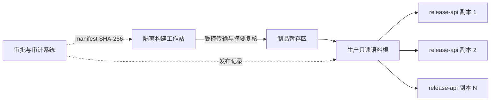

# 泄露口令摘要语料部署实施文档

## 1. 文档目的

本文档用于指导 Xminds Release Platform 在生产、预发和测试环境中构建、交付、验证、启用、轮换和回滚泄露口令摘要语料。本文档不授权任何数据来源；来源许可、字段边界和审批要求必须先满足《生产泄露口令摘要语料治理规范》。

## 2. 实施范围

实施对象包括：

- 隔离构建工作站；
- 受控制品传输通道；
- API 节点或只读共享文件系统；
- `release-api` 运行配置；
- 监控、审计、变更和回滚流程。

`release-worker` 不需要加载泄露口令语料。语料不得进入容器镜像、Git 仓库、数据库、普通对象存储公共桶或配置中心明文字段。

## 3. 角色与职责

| 角色 | 职责 |
|---|---|
| 安全治理人员 | 批准来源、字段、用途、保留期和更新策略 |
| 法务或采购人员 | 复核许可证、商业使用及再分发条件 |
| 构建操作人员 | 在隔离环境验证输入并生成内容寻址发布目录 |
| 发布审批人员 | 独立复核输入、清单摘要、部署计划和回滚版本 |
| 平台运维人员 | 配置账户、目录、只读挂载、灰度和滚动重启 |
| 审计人员 | 核对审批、清单、部署结果和回滚证据 |

构建、审批和生产发布不得由同一人员独立完成。

## 4. 部署拓扑



共享文件系统不是强制要求。采用逐节点分发时，每个节点必须具有完全相同的发布目录名称、`corpus.txt` SHA-256 和 `manifest.json` SHA-256。

## 5. 前置条件

- 已完成来源、字段和许可证审批；
- 已获得只包含 SHA-1/SHA-256 摘要的只读输入制品；
- 构建工作站全盘加密、禁止云盘同步和终端录屏；
- 构建工具来自已审核提交，`bin/breach-corpus` 具有可追溯版本和提交号；
- 生产节点已建立独立部署账户或由 `root` 执行；
- 已分配只读服务组，例如 `xminds-release-corpus`；
- 已确认 `release-api` 的稳定 numeric UID/GID；
- 当前版本和上一已批准版本均可获取；
- 变更窗口、灰度节点、停止条件和回滚负责人已经明确。

## 6. 目录与权限基线

以下示例假设部署账户为 `root`，服务组 GID 为 `2001`。实际 UID/GID 必须由组织账户治理系统分配，不得直接照抄示例。

```bash
install -d -o root -g root -m 0750 /opt/xminds
install -d -o root -g root -m 0750 /opt/xminds/breach-corpora
```

正式发布目录基线：

```text
/opt/xminds/breach-corpora                         root:root                    0750
└── breach-corpus-sha256-<digest>                  root:xminds-release-corpus  0550
    ├── corpus.txt                                 root:xminds-release-corpus  0440
    └── manifest.json                              root:xminds-release-corpus  0440
```

安全要求：

- API 服务 UID 不得拥有上述目录或文件；
- API 服务 UID 只能通过专用组读取，不得具有目录写权限；
- 发布根、发布目录和文件均不得为符号链接；
- 禁止使用 `current` 等可变符号链接；
- 容器部署必须使用只读 volume mount，并保持宿主机 numeric UID/GID 映射一致；
- Kubernetes `ConfigMap`/`Secret` 不适合承载 128 MiB 级语料，不得作为默认分发方案。

## 7. 离线构建实施

### 7.1 创建隔离工作目录

```bash
umask 077
work_dir="$(mktemp -d /secure/xminds-breach-build.XXXXXX)"
chmod 0700 "$work_dir"
```

`/secure` 必须位于受控加密介质。命令历史、终端输出和日志不得包含下载凭据或摘要内容。

### 7.2 准备构建请求

构建请求必须列明内部版本、来源版本、预期输入 SHA-256 和许可证复核编号。请求文件权限应为 `0600`，未知字段会导致构建失败。

### 7.3 执行构建

```bash
bin/breach-corpus build \
  --request "$work_dir/build-request.json" \
  --input source-a="$work_dir/source-a.txt" \
  --output-root "$work_dir/output"
```

记录 CLI 返回的发布目录名称、语料条目数、语料 SHA-256 和清单 SHA-256。不得复制终端中的源文件内容。

### 7.4 制品验证

```bash
bin/breach-corpus verify \
  --release-dir "$work_dir/output/breach-corpus-sha256-<digest>"
```

由不同人员再次计算并复核 `corpus.txt` 与 `manifest.json` 的 SHA-256。复核结果进入审批记录，不写回清单。

## 8. 制品传输与落盘

1. 使用组织批准的加密、认证传输通道；
2. 在源端和目标端分别核对发布目录名称、语料 SHA-256 和清单 SHA-256；
3. 先传输到只有部署账户可写的临时目录；
4. 校验通过后设置 owner、group 和只读权限；
5. 使用同一文件系统内的原子重命名移入正式发布根；
6. 不得覆盖、原地编辑或复用已有内容寻址目录。

示例：

```bash
chown -R root:2001 /var/lib/xminds-release-staging/breach-corpus-sha256-<digest>
find /var/lib/xminds-release-staging/breach-corpus-sha256-<digest> -type d -exec chmod 0550 {} +
find /var/lib/xminds-release-staging/breach-corpus-sha256-<digest> -type f -exec chmod 0440 {} +
mv /var/lib/xminds-release-staging/breach-corpus-sha256-<digest> /opt/xminds/breach-corpora/
```

传输暂存区与正式发布根必须在同一文件系统；否则 `mv` 不是原子操作，应先复制到正式发布根内的隐藏临时目录，验证后再重命名。

## 9. 部署前验收

```bash
bin/breach-corpus verify \
  --mode deployment \
  --release-dir /opt/xminds/breach-corpora/breach-corpus-sha256-<digest> \
  --expected-owner-uid 0 \
  --expected-group-gid 2001
```

同时使用实际 API 服务 UID 验证：

```bash
sudo -u xminds-release-api test -r /opt/xminds/breach-corpora/breach-corpus-sha256-<digest>/corpus.txt
sudo -u xminds-release-api test ! -w /opt/xminds/breach-corpora/breach-corpus-sha256-<digest>/corpus.txt
sudo -u xminds-release-api test ! -w /opt/xminds/breach-corpora/breach-corpus-sha256-<digest>
```

不得仅依据 `ls -l` 判断服务账户无法修改文件；必须以实际服务 UID 执行读取、写入和目录替换能力测试。

## 10. 应用配置

```bash
XMINDS_RELEASE_IAM_BREACH_CORPUS_RELEASE_DIR=/opt/xminds/breach-corpora/breach-corpus-sha256-<digest>
XMINDS_RELEASE_IAM_USE_DEVELOPMENT_BREACH_CORPUS=false
```

生产、预发和测试环境不得设置旧变量 `XMINDS_RELEASE_IAM_BREACH_CORPUS`。配置变更必须使用绝对、内容寻址发布目录，并进入变更审计。

容器示例：

```yaml
services:
  release-api:
    volumes:
      - type: bind
        source: /opt/xminds/breach-corpora/breach-corpus-sha256-<digest>
        target: /run/xminds/breach-corpora/breach-corpus-sha256-<digest>
        read_only: true
    environment:
      XMINDS_RELEASE_IAM_BREACH_CORPUS_RELEASE_DIR: /run/xminds/breach-corpora/breach-corpus-sha256-<digest>
      XMINDS_RELEASE_IAM_USE_DEVELOPMENT_BREACH_CORPUS: "false"
```

容器内目标路径也必须保留内容寻址目录名；若挂载为 `/run/xminds/breach-corpus` 等可变名称，运行时会因目录名无法绑定语料 SHA-256 而拒绝启动。

## 11. 灰度与滚动发布

1. 选择一个非生产或生产灰度副本；
2. 应用新内容寻址路径并重启该副本；
3. 确认进程启动、readiness、版本摘要和控制测试均通过；
4. 观察登录与口令变更错误率，不记录候选口令或命中摘要；
5. 按批次滚动其余副本，每批验证后再继续；
6. 最终核对所有副本使用同一语料版本和 SHA-256；
7. 将结果、清单 SHA-256、节点清单和时间写入审计系统。

停止条件：启动失败、清单不一致、异常拒绝率、节点版本漂移、readiness 失败或无法确认回滚版本时，立即停止扩大发布。

## 12. 控制测试

控制测试必须使用专用测试账户和经批准的测试口令样本：

- 语料中已知测试摘要对应的口令被拒绝；
- 不在语料中的满足策略口令可以继续进入 Argon2id 哈希流程；
- 日志只记录拒绝类别和计数，不记录口令或命中摘要；
- API 重启后仍加载同一版本；
- 多副本返回一致结果。

禁止在生产日志、工单或命令行参数中暴露控制测试口令。

## 13. 监控与审计

至少监控：

- 每个 API 副本当前语料内部版本和 SHA-256；
- 加载成功、失败及稳定错误类别；
- 多副本摘要不一致；
- 上游版本检查延迟；
- 本地口令因泄露语料被拒绝的聚合计数趋势；
- 发布根权限、所有权或配置路径的未授权变化。

审计记录至少包含：变更单、构建工具提交、输入制品摘要、清单摘要、审批人、目标环境、灰度结果、全部副本结果、回滚版本和关闭时间。

## 14. 回滚实施

1. 停止扩大新版本；
2. 确认上一内容寻址发布目录仍通过部署验证；
3. 将灰度副本配置切回上一目录并重启验证；
4. 按批次滚动回滚其余副本；
5. 核对所有副本摘要一致；
6. 保留故障版本为只读隔离证据，不原地修改；
7. 记录原因、影响、时间线和后续处置。

不得通过启用 development 内置语料、空文件或跳过清单验证恢复生产。

## 15. 应急与退役

- 来源撤回或许可证失效：冻结继续分发，由安全和法务决定替换、隔离或销毁；
- 完整性事件：隔离制品、停止发布、回滚上一已批准版本并启动安全事件响应；
- 无可验证回滚版本：保持失败关闭，不得降低口令策略；
- 退役版本：超过组织保留期后由双人复核删除，并保留不含语料内容的清单摘要和审批证据；
- 隐藏临时目录：确认无活动构建进程且不符合任何已批准发布记录后，由部署账户在明确路径内清理。

## 16. 验收清单

- [ ] 来源、字段、许可证和输入摘要审批完成；
- [ ] 构建工具版本和提交可追溯；
- [ ] 技术清单与外部审批记录通过清单 SHA-256 关联；
- [ ] 发布目录名称、语料摘要和清单三方一致；
- [ ] 部署模式验证通过；
- [ ] 实际服务 UID 可读但无法写入、改权、重命名或替换；
- [ ] 灰度副本启动、readiness 和控制测试通过；
- [ ] 所有副本版本与摘要一致；
- [ ] 监控、告警和审计记录已经生成；
- [ ] 上一版本部署验证通过且回滚流程已演练；
- [ ] 日志、清单和工单不包含口令、命中摘要或上游凭据。

## 17. 结论与建议

生产启用的最小可信单元是“内容寻址发布目录＋技术清单＋外部审批记录”，不是单独的摘要文件。建议每月至少检查一次上游版本，每半年演练一次回滚，并在后续阶段评估清单离线签名和跨副本自动漂移告警。
