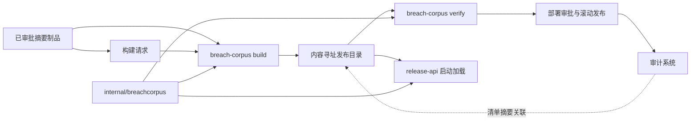

# 泄露口令摘要语料工具链设计

## 1. 项目背景

Xminds Release Platform 已在本地账户口令设置与变更流程中使用 SHA-1/SHA-256 泄露口令摘要语料进行确定性成员查询。现有运行时能够拒绝格式错误、空文件、超限文件、可写文件和符号链接，但语料构建、稳定去重、技术清单、部署前验收和运行时清单绑定尚未形成统一的可执行工具链。

本设计将治理规范转化为一个离线 Go 工具和共享领域模块。工具只处理已审批的摘要制品，永不接收明文口令，也不提供明文转摘要能力。

## 2. 建设目标

- 以单一领域模块统一构建、验证和运行时加载规则；
- 对多个已审批输入执行完整性验证、规范化、稳定排序和去重；
- 生成内容寻址发布目录及可机器验证的技术清单；
- 在部署前验证文件类型、摘要、所有权、权限和父目录边界；
- 生产运行时同时验证语料、清单和内容寻址目录，任何异常均失败关闭；
- 提供可重复、可审计、可回滚且不依赖平台 `sort` 命令的离线流程。

## 3. 非目标

- 不下载、抓取或发现外部泄露数据；
- 不接收、保存、转换或输出明文口令及账户关系；
- 不替代法务、采购、安全审批或审计系统；
- 不在技术清单中伪造审批人、审批时间或生产授权；
- 不将 SHA-1/SHA-256 用作平台凭据存储算法；本地凭据仍固定使用随机盐 Argon2id；
- 不在 P0 工具链内引入独立清单签名体系，清单真实性由受控构建、内容摘要、制品传输和外部审批记录共同保证。

## 4. 需求与约束

### 4.1 输入约束

- 每个有效行只能是 40 位 SHA-1 或 64 位 SHA-256 十六进制摘要；
- 允许空行和首尾空白，允许去除首尾空白后以 `#` 开头的注释行；
- 输入摘要不区分大小写，输出统一为大写；
- 单行不得超过 4096 字节；
- 单次构建最多 32 个输入，输入总量不得超过 512 MiB；
- 输入必须是普通文件、不得为符号链接，并在打开前后保持同一文件身份；
- 每个输入的实际 SHA-256 必须与构建请求中的预期值一致；
- 任一非法行、缺失来源、重复来源 ID 或多余输入均导致整个构建失败且不发布产物。

### 4.2 输出约束

- 成功语料非空且不得超过 128 MiB；
- 输出只包含大写摘要，每行一个，不保留输入注释和本地路径；
- 输出按字典序严格递增，不包含重复条目；
- 发布目录、语料文件和清单禁止覆盖；
- 语料和清单无任何写权限位；
- 发布目录名称精确包含语料 SHA-256。

## 5. 总体架构



### 5.1 模块职责

| 模块 | 职责 | 禁止事项 |
|---|---|---|
| `internal/breachcorpus` | 格式、限制、构建请求、稳定归并、清单和发布目录验证 | 访问网络、记录摘要内容、处理明文口令 |
| `scripts/breach-corpus` | CLI 参数、退出码和面向运维的非敏感输出 | 复制领域规则、忽略验证错误 |
| `internal/iam` | 将已验证语料封装为 `BreachChecker` | 绕过清单、自动降级为开发语料 |
| 部署流程 | 所有权、专用组、灰度、重启、一致性和回滚 | 修改已发布目录或复用可变路径 |
| 审计系统 | 记录审批、目标环境、生效时间、回滚版本和清单摘要 | 保存口令、命中摘要或上游凭据 |

## 6. 命令契约

### 6.1 构建

```bash
bin/breach-corpus build \
  --request /secure/build-request.json \
  --input source-a=/secure/input/source-a.txt \
  --input source-b=/secure/input/source-b.txt \
  --output-root /secure/output
```

构建请求采用严格 JSON，未知字段、尾随内容和重复来源均被拒绝：

```json
{
  "schema_version": 1,
  "corpus_version": "2026.08.30.1",
  "sources": [
    {
      "id": "source-a",
      "version": "2026-08",
      "expected_sha256": "0123456789abcdef0123456789abcdef0123456789abcdef0123456789abcdef",
      "license_review_ref": "LEGAL-2026-001"
    }
  ]
}
```

CLI 对 `--input <source-id>=<absolute-path>` 进行一一绑定。路径只用于当前构建，不进入语料或清单。

### 6.2 验证

制品验证：

```bash
bin/breach-corpus verify \
  --release-dir /secure/output/breach-corpus-sha256-<digest>
```

部署验证：

```bash
bin/breach-corpus verify \
  --mode deployment \
  --release-dir /opt/xminds/breach-corpora/breach-corpus-sha256-<digest> \
  --expected-owner-uid 0 \
  --expected-group-gid 2001
```

退出码：

| 退出码 | 含义 |
|---|---|
| `0` | 构建或验证成功 |
| `1` | 数据、I/O、完整性或安全策略失败 |
| `2` | 参数或命令用法错误 |

标准输出仅返回版本、计数、字节数、摘要和产物路径；标准错误不得包含摘要行、口令、下载凭据或源文件内容。

## 7. 数据架构

### 7.1 发布目录

```text
breach-corpus-sha256-<64位小写摘要>/
├── corpus.txt
└── manifest.json
```

`corpus.txt` 是规范化的大写摘要集合。`manifest.json` 是严格、稳定字段顺序的 UTF-8 JSON，末尾包含一个换行。

### 7.2 技术清单

```json
{
  "schema_version": 1,
  "format": "xminds-breach-corpus/v1",
  "corpus_version": "2026.08.30.1",
  "generated_at": "2026-08-30T12:00:00Z",
  "generator": {
    "name": "xminds-breach-corpus",
    "version": "0.1.0-p0",
    "commit": "0123456789ab"
  },
  "sources": [
    {
      "id": "source-a",
      "version": "2026-08",
      "bytes": 12345,
      "sha256": "0123456789abcdef0123456789abcdef0123456789abcdef0123456789abcdef",
      "license_review_ref": "LEGAL-2026-001"
    }
  ],
  "corpus": {
    "file": "corpus.txt",
    "bytes": 67890,
    "sha256": "abcdef0123456789abcdef0123456789abcdef0123456789abcdef0123456789",
    "sha1_entries": 1000,
    "sha256_entries": 500,
    "unique_entries": 1500,
    "duplicate_entries": 25,
    "rejected_entries": 0
  }
}
```

来源数组按来源 ID 排序。成功清单中的 `rejected_entries` 固定为 `0`；失败构建只向标准错误输出非敏感错误类别，不生成清单。

审批人、审批时间、目标环境、计划生效时间和上一回滚版本属于外部审批记录。审批记录必须保存 `manifest.json` 的 SHA-256 以建立不可混淆的关联。

## 8. 构建算法与原子性

1. 验证构建请求、输出根目录和全部来源绑定；
2. 对每个输入执行 `Lstat → Open → Fstat` 身份校验，并在单次流式读取中同时计算 SHA-256 和解析摘要；
3. 使用固定内存预算形成有序、去重的临时 run 文件；
4. 对 run 文件执行确定性多路归并，跨输入去重并统计 SHA-1/SHA-256 条目；
5. 流式写入临时 `corpus.txt`，同时计算输出字节数和 SHA-256；
6. 生成临时 `manifest.json`，同步文件内容和临时目录；
7. 将文件权限收敛为只读；
8. 将同一输出根内的临时目录原子重命名为内容寻址发布目录；
9. 同步输出根目录并返回非敏感结果。

工具可处理的错误必须清除临时目录。主机掉电或进程被强制终止可能遗留隐藏临时目录；该目录不符合内容寻址名称，验证器和运行时必须拒绝，运维按部署文档清理。

## 9. 运行时架构

生产、预发和测试环境使用：

```text
XMINDS_RELEASE_IAM_BREACH_CORPUS_RELEASE_DIR=/opt/xminds/breach-corpora/breach-corpus-sha256-<digest>
```

旧的单文件变量 `XMINDS_RELEASE_IAM_BREACH_CORPUS` 不再作为有效配置，避免同时存在“只校验文件”和“校验发布目录”两条安全路径。

启动顺序：

1. 验证发布目录为绝对路径且名称合法；
2. 拒绝链接、设备、命名管道、可写文件和不可信父目录；
3. 读取并严格解析清单；
4. 流式验证规范化语料、条目计数和 SHA-256；
5. 校验清单摘要、目录摘要和文件摘要一致；
6. 构建内存成员集合；
7. 完成已泄露/未泄露控制检查后开放服务。

运行时服务 UID 不得拥有发布目录、语料或清单，否则其可以自行执行 `chmod` 并改变内容。运行时仅允许读取，不提供热重载；轮换必须更改内容寻址路径并滚动重启。

## 10. 安全架构

- 默认失败关闭，禁止跳过格式、摘要、清单或文件身份检查；
- 输入和临时文件始终位于权限不高于 `0700` 的受控目录；
- 临时文件权限固定为 `0600`，正式语料和清单无写权限位；
- 不使用 Shell 管道、区域相关排序或网络服务；
- 严格 JSON 解码拒绝未知字段和尾随数据；
- 所有计数和字节累加执行溢出检查；
- 文件打开前后身份必须一致，构建和验证都不跟随符号链接；
- 构建日志不得包含摘要行、明文口令、源路径以外的敏感内容或下载凭据；
- 技术清单不等同于审批或签名，生产发布必须由外部职责分离流程授权。

## 11. 部署、运维、高可用与容灾

- 构建在隔离工作站完成，生产节点只接收语料发布目录；
- 多个 API 副本必须挂载同一只读发布版本或分发同一清单摘要；
- 轮换采用单副本验证、分批滚动和最终全副本版本盘点；
- 当前版本和上一已批准版本至少保留一份；
- 回滚只切回上一内容寻址目录并重启，不修改现有产物；
- 监控加载失败、版本漂移、更新滞后和异常口令拒绝率，不记录命中摘要；
- 发布目录不是业务状态，高可用依赖受控制品分发，不依赖数据库复制；
- 灾难恢复必须从已批准只读制品及其清单恢复，并重新执行部署验证。

## 12. 测试策略

- 单元测试：格式、边界、严格 JSON、规范化、计数和清单；
- 属性测试：输入顺序、大小写和重复分布变化不改变输出摘要；
- 文件系统测试：链接、权限、打开前后身份、覆盖拒绝和失败清理；
- CLI 测试：参数、退出码、非敏感输出和部署模式；
- IAM 回归测试：SHA-1/SHA-256 命中、安全口令放行、清单篡改和缺失失败；
- 本地总体验证：`go test ./... -race -count=1` 与 `make verify`；
- 生产验收：真实 Linux UID/GID、只读挂载、滚动重启、多副本一致性和回滚演练。

## 13. 风险分析

| 风险 | 影响 | 控制措施 | 剩余风险 |
|---|---|---|---|
| 上游摘要制品被篡改 | 错误放行或误拒绝 | 输入预期 SHA-256、来源准入和职责分离 | 上游自身数据质量无法由工具证明 |
| 构建资源耗尽 | 构建节点不可用 | 输入数量/总量、行长、输出容量和有界归并 | 极端合法输入仍需预留磁盘容量 |
| 清单被误认为审批 | 未授权制品进入生产 | 技术证据与审批记录分离、以清单摘要关联 | 审计系统本身仍需访问控制 |
| 文件与清单不一致 | 运行时策略漂移 | 内容寻址目录、启动四方校验 | 受信部署账户被攻陷仍可替换整套制品 |
| 强制终止遗留临时目录 | 磁盘占用 | 隐藏临时目录不可加载、运维定期清理 | 清理前仍占用磁盘空间 |
| 多副本版本漂移 | 账户策略不一致 | 分批发布、版本监控和最终盘点 | 滚动窗口内短暂双版本不可避免 |

## 14. 验收标准

- [ ] CLI 永不接收明文口令；
- [ ] 构建请求与清单模式固定为版本 1 并严格解码；
- [ ] 同一摘要集合在不同输入顺序下产生相同 `corpus.txt` 和目录摘要；
- [ ] 任一非法输入不会生成可验证发布目录；
- [ ] 部署验证能拒绝错误摘要、所有权、权限和父目录；
- [ ] 生产运行时缺少或篡改清单时拒绝启动；
- [ ] development 内置语料不能在其他环境启用；
- [ ] 自动化测试、竞态测试、构建、边界和 macOS 元数据检查通过；
- [ ] 真实 Linux 环境完成 UID/GID、只读挂载、灰度、全副本一致性和回滚验收；
- [ ] 审计记录不包含口令、命中摘要或上游凭据。

## 15. 后续规划

- 根据风险评估决定是否为技术清单增加独立离线签名角色；
- 将构建与部署验收结果接入统一审计事件模型；
- 增加语料版本滞后和多副本摘要漂移的指标与告警；
- 在具备合法、稳定的上游接口后评估受控下载适配器，但保持下载与构建职责分离。
