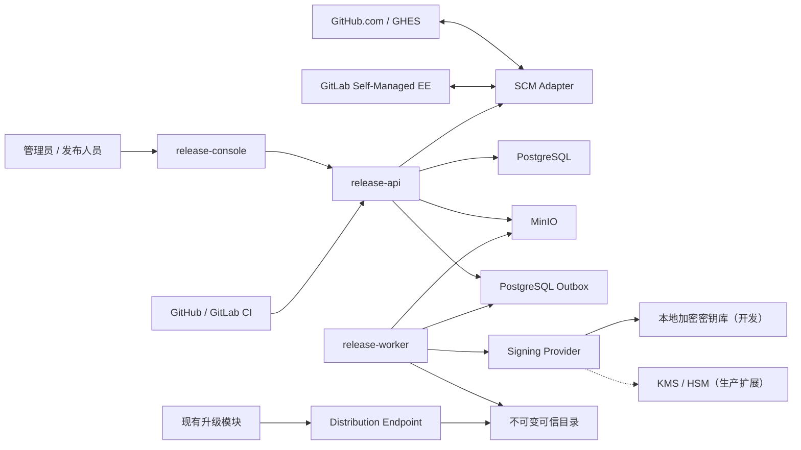
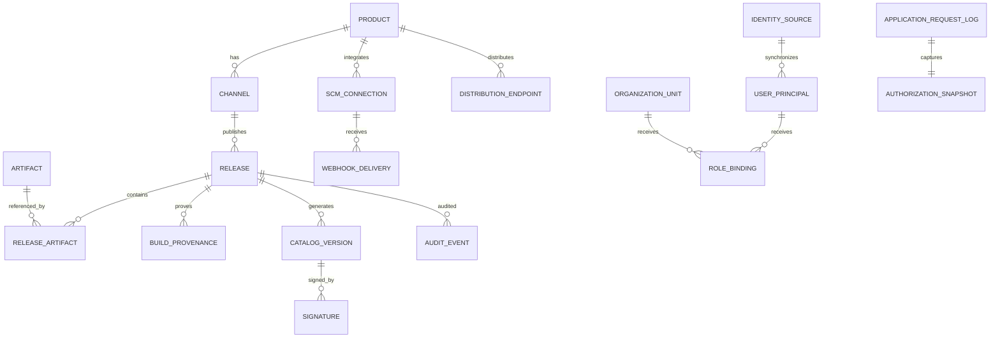
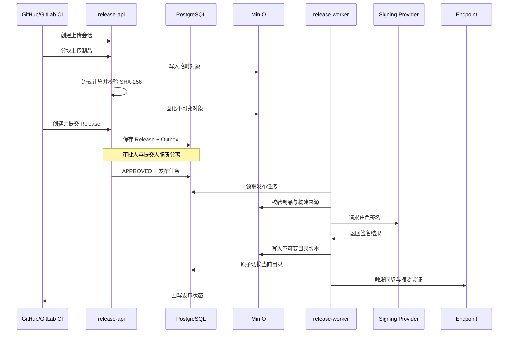

# Xminds Release Platform P0 设计规格

| 项目 | 内容 |
|---|---|
| 产品名称 | Xminds Release Platform |
| 产品标识 | `xminds-release-platform` |
| 文档版本 | v1.1 |
| 编制日期 | 2026-08-14 |
| 文档状态 | 已确认设计基线 |
| 实施范围 | P0 多产品可信发布最小闭环 |
| 项目位置 | `/Volumes/Samsung/办公文件/code/Xminds Release Platform` |

## 1. 背景

Enterprise Portal 已具备商业级升级管理能力，包括在线和离线更新、可信目录验证、升级预检、执行、回滚、进度展示及审计。现阶段缺少独立的供给侧发布平台，在线更新源、制品生命周期、可信目录签发、审批审计以及 GitHub/GitLab 流水线接入仍需统一建设。

Xminds Release Platform 定位为独立产品。P0 不追求一次实现全部商业化能力，而是先交付可运行、可验证、可扩展的多产品可信发布闭环，并以 `ngep` 作为首个真实样板产品。

## 2. 建设目标

P0 建设目标如下：

1. 支持多个产品通过统一 `product-manifest` 注册，不在核心代码中硬编码 `ngep`。
2. 支持制品上传、摘要校验、不可变存储、Release 创建、职责分离审批和发布。
3. 生成 root、targets、snapshot、timestamp、revocation 五角色 TUF 风格可信目录。
4. 保持 `/metadata/{role}.json` 兼容路径，使现有升级模块零代码修改完成在线更新检测。
5. 支持 GitHub.com、GitHub Enterprise Server、GitLab Self-Managed 企业版的 CI API、Webhook 和状态回写。
6. 支持私有 DNS、内网 IP、企业 CA、代理和完全无公网环境。
7. 以 Docker Compose 交付可恢复的 P0 生产基线，并保持向 RKE2/Helm 演进时应用代码不变。
8. 建立可测试、可观测、可审计、可拆仓的独立工程边界。
9. 建立外部身份同步、本地账户、组织、角色和产品范围的身份治理闭环。
10. 建立统一日志中心，并为应用请求保存可信、不可变的请求时授权快照。

## 3. P0 范围边界

### 3.1 纳入范围

- 多产品注册、产品契约和产品级权限隔离；
- GitHub/GitLab SCM 连接、能力探测、Webhook、CI 发布和状态回写；
- 分块制品上传、SHA-256 校验、去重和不可变存储；
- Release 创建、提交、审批、发布、失败重试和 Release Notes；
- 五角色可信目录、目录兼容路径和多产品命名空间；
- 本地加密签名 Provider、KMS/HSM 扩展接口和离线 root 密钥管理；
- Distribution Endpoint 注册、同步、摘要一致性验证和健康状态；
- OIDC、CI 工作负载身份、RBAC 和产品作用域；
- 外部身份同步、本地账户、组织架构、角色绑定、SSO 登录模式和应急访问治理；
- 操作日志、登录日志、应用请求日志和 Git 同步日志的统一查询、导出和请求关联；
- 可信上游授权上下文校验，以及客户、授权名称、客户端应用版本、License ID、到期时间和请求时状态的不可变快照；
- Docker Compose 在线与离线交付、备份恢复和基础监控告警。

### 3.2 后续阶段范围

下列能力不在 P0 实现，但必须通过稳定接口预留扩展点：

- Tenant 多租户商业模型；
- License 创建、签发、续期、扩容、计量、吊销和密钥生成闭环；
- Telemetry 数据回流与版本覆盖率；
- 灰度发布策略引擎；
- OPA 策略执行器；
- SBOM、漏洞扫描和 SLSA 构建证明验证器；
- RKE2/Helm 高可用和跨区域容灾。

## 4. 产品与技术标识

| 类型 | 约定 |
|---|---|
| 显示名称 | Xminds Release Platform |
| 产品标识 | `xminds-release-platform` |
| 项目目录 | 独立仓库根目录（历史计划中的 `Release platform/` 前缀在执行时省略） |
| Go module | P0 使用 `xminds-release-platform`，确定独立仓库地址后一次性调整为完整模块路径 |
| 镜像 | `xminds/release-api`、`xminds/release-worker`、`xminds/release-console` |
| 配置前缀 | `XMINDS_RELEASE_` |
| 默认数据库 | `xminds_release_platform` |
| API 标题 | `Xminds Release Platform API` |
| 审计服务名 | `xminds-release-platform` |

## 5. 架构决策

P0 采用模块化单体，部署为 API、Worker、Console 三个应用进程。各领域通过明确端口协作，禁止跨领域直接访问内部实现。此方案兼顾事务一致性、交付速度、部署复杂度和后续微服务拆分能力。

### 5.1 总体架构



### 5.2 核心约束

- `release-api` 不直接持有在线签名私钥；
- `release-worker` 通过最小权限 Signing Port 请求签名；
- root 密钥离线生成和保管，不进入在线容器；
- PostgreSQL Outbox 保证业务状态和异步任务原子落库，P0 不引入 Kafka；
- MinIO 仅保存按 SHA-256 寻址的不可变制品和已签名目录；
- 每个产品和通道只有一个目录单写者，元数据版本严格递增；
- SCM 厂商适配器不得向核心领域泄露厂商 SDK 类型；
- 管理 API 和公开目录 API使用不同监听入口、认证策略、限流与网络策略。
- 客户端自报的 Header、Query 或请求体字段不得作为 License 授权事实；只接受经 mTLS、签名上下文或进程内可信适配器验证的授权上下文；
- 请求时授权快照一次写入、禁止更新，不随上游客户或 License 状态变化而回填。

## 6. 项目结构

项目已初始化为独立 Git 仓库，不得依赖父项目的相对路径、构建脚本或运行时文件。仓库应能整体移动而无需重构。

```text
Xminds-Release-Platform/
├── apps/
│   ├── release-api/
│   ├── release-worker/
│   └── release-console/
├── internal/
│   ├── product/
│   ├── artifact/
│   ├── release/
│   ├── catalog/
│   ├── signing/
│   ├── scm/
│   ├── identity/
│   ├── iam/
│   ├── audit/
│   ├── authorizationcontext/
│   ├── logcenter/
│   └── platform/
├── migrations/
├── deploy/
│   ├── compose/
│   └── config/
├── docs/
│   ├── architecture/
│   ├── api/
│   ├── operations/
│   ├── security/
│   └── superpowers/
│       ├── specs/
│       └── plans/
├── tests/
│   ├── integration/
│   ├── contract/
│   └── e2e/
├── scripts/
├── Makefile
├── go.mod
└── README.md
```

## 7. 领域模型



### 7.1 Product

Product 是权限、通道、Release、SCM 连接和 Endpoint 的隔离边界。`product-manifest` 至少定义产品标识、显示名称、支持的制品类型、版本规则、兼容性维度、目录格式版本和默认通道。Manifest 采用版本化 JSON Schema 校验。

### 7.2 Artifact

Artifact 使用 SHA-256 内容寻址。上传完成后禁止覆盖或修改。同一摘要只保存一个物理对象，通过关联表绑定到多个 Release。上传过程必须限制单文件大小、总大小、分块数量和完成时限。

### 7.3 Release

Release 状态机为：

```text
DRAFT → SUBMITTED → APPROVED → PUBLISHING → PUBLISHED
                    ↘ REJECTED      ↘ FAILED
```

禁止跳跃状态。提交者不得审批本人提交的 Release。已发布 Release 不得物理删除；撤回或回滚通过 revocation 和新 timestamp 表达。

### 7.4 CatalogVersion

CatalogVersion 记录产品、通道、角色版本、摘要、对象引用、签名集合和发布时间。root、targets、snapshot、timestamp、revocation 的版本必须单调递增。发布切换只有在全部角色生成、签名和交叉摘要校验成功后才可见。

### 7.5 SCMConnection

SCMConnection 保存 Provider 类型、实例 Base URL、API URL、企业 CA 引用、代理策略、凭据引用、能力探测结果和状态。敏感凭据仅保存密文与元数据，不保存可查询明文。

### 7.6 AuditEvent

AuditEvent 记录操作者或工作负载身份、角色、产品、动作、目标、结果、时间、请求 ID、来源 IP 和前后状态摘要。普通管理员无权修改或删除审计记录。

### 7.7 身份治理对象

`UserPrincipal` 统一表示外部、本地和应急用户；`IdentitySource` 管理 OIDC 与目录来源；`OrganizationUnit` 表示外部同步或平台本地组织；`RoleBinding` 将用户或组织绑定到平台、产品或产品与通道范围。外部主数据字段只读，平台角色和产品授权不得被目录同步覆盖。

### 7.8 AuthorizationSnapshot

AuthorizationSnapshot 是应用请求发生时的不可变授权证据，记录客户稳定标识与名称、授权名称、发起请求的客户端应用版本、License ID、到期时间、请求时状态、允许或拒绝判定、稳定原因码、校验方和上下文摘要。License ID 仅为标识符，不得保存 License Key、签名原文或授权私钥。

身份治理、授权快照、统一日志的详细契约以 `2026-08-14-xminds-release-platform-p0-identity-log-baseline-design.md` 为规范性补充。

## 8. 发布流程



### 8.1 一致性与幂等

- Webhook 以厂商事件 ID 和连接 ID 组成幂等键；
- CI 请求支持显式 `Idempotency-Key`；
- Release 版本在产品和通道内唯一；
- 制品摘要不一致时终止上传并隔离临时对象；
- Worker 使用带租约的 Job 领取机制，崩溃后可安全重试；
- SCM 状态回写失败不回滚已成功发布的可信目录，失败任务指数退避并进入死信审计；
- 所有签名和发布 attempt 均独立记录，不覆盖失败证据。

## 9. SCM 集成设计

### 9.1 支持范围

P0 支持：

- GitHub.com；
- GitHub Enterprise Server；
- GitLab Self-Managed 企业版；
- 私有域名、私有 DNS、内网 IP；
- 自签或企业内部 CA；
- HTTP/HTTPS 代理和 `NO_PROXY`；
- 完全隔离、无公网访问环境；
- Webhook、CI 发布 API、Commit/Check 状态回写；
- 仓库、Tag、Commit SHA、流水线与构建来源绑定。

### 9.2 Provider Port

SCM Provider Port 统一提供以下语义能力：

- 验证连接和探测实例能力；
- 验证 Webhook 签名并解析标准事件；
- 获取仓库和提交元数据；
- 校验 CI 工作负载身份；
- 创建或更新提交状态；
- 查询实例版本和受支持特性。

GitHub Adapter 与 GitLab Adapter 分别映射厂商 API，但输出统一领域类型。P0 登录认证继续使用通用 OIDC，不将 GitHub/GitLab 登录逻辑耦合到发布域。

### 9.3 私有实例安全

- SCM Base URL 只能由管理员登记并通过连接验证；
- 出站访问仅允许已登记实例和显式代理；
- 禁止跟随重定向至未登记主机；
- 企业 CA 必须上传、显示指纹、确认后启用，并保留版本和审计；
- 禁止使用全局跳过 TLS 验证；
- Webhook 强制签名、时间窗、事件 ID 去重、载荷大小限制和速率限制；
- Webhook 审计保留摘要、事件类型和处理结果，不默认保存敏感原始载荷。

## 10. 身份、权限与凭据

### 10.1 人员身份

平台支持外部身份平台和本地账户。SSO 未启用时使用本地登录；SSO 启用后普通用户使用 OIDC，普通本地登录关闭，仅保留独立、强制 MFA、完整审计的应急入口。SSO 故障不得自动开放普通本地登录。

外部目录同步优先采用 SCIM 2.0 或厂商目录适配器；OIDC 只承担认证，不假定提供完整用户和组织目录。系统内置角色：

| 角色 | 权限 |
|---|---|
| `admin` | 平台配置、身份映射、SCM 连接和产品管理 |
| `publisher` | 上传制品、创建和提交 Release |
| `approver` | 审批或拒绝 Release |
| `auditor` | 只读查询和导出审计证据 |
| `viewer` | 只读查看授权产品范围内的资源和发布状态 |

权限同时受产品范围约束。角色不能绕过产品隔离。

### 10.2 CI 身份

优先验证 GitHub Actions 或 GitLab CI OIDC 工作负载令牌。无法提供 OIDC 的私有环境使用产品级、短有效期、最小作用域 API Token。Token 只显示一次，存储摘要，支持轮换和立即吊销。

### 10.3 凭据与密钥

- SCM 凭据采用信封加密；
- 开发环境使用本地加密 Key Provider；
- 生产接口预留 KMS/HSM Provider；
- Secret 通过文件挂载，不进入镜像、源码、普通日志或错误响应；
- root 密钥离线生成、双人保管，在线服务不加载 root 私钥；
- 在线角色密钥遵循最小权限、轮换、吊销和使用审计。

## 11. API 设计

### 11.1 管理与 CI API

```text
POST   /api/v1/products
GET    /api/v1/products
POST   /api/v1/products/{product}/scm-connections
POST   /api/v1/scm-connections/{id}/verify
POST   /api/v1/webhooks/github/{connection_id}
POST   /api/v1/webhooks/gitlab/{connection_id}

POST   /api/v1/products/{product}/artifacts/uploads
PATCH  /api/v1/artifact-uploads/{upload_id}
POST   /api/v1/artifact-uploads/{upload_id}/complete

POST   /api/v1/products/{product}/releases
POST   /api/v1/releases/{id}/submit
POST   /api/v1/releases/{id}/approve
POST   /api/v1/releases/{id}/publish
GET    /api/v1/releases/{id}

POST   /api/v1/products/{product}/endpoints
POST   /api/v1/endpoints/{id}/verify
GET    /api/v1/audit-events

GET    /api/v1/users
POST   /api/v1/local-users
POST   /api/v1/users/{id}/disable
POST   /api/v1/users/{id}/enable
POST   /api/v1/users/{id}/revoke-sessions
GET    /api/v1/organizations
POST   /api/v1/organizations
GET    /api/v1/role-bindings
POST   /api/v1/role-bindings
DELETE /api/v1/role-bindings/{id}
GET    /api/v1/identity-sources
POST   /api/v1/identity-sources
PATCH  /api/v1/identity-sources/{id}
POST   /api/v1/identity-sources/{id}/verify
POST   /api/v1/identity-sources/{id}/sync
POST   /api/v1/identity-sources/{id}/enable
POST   /api/v1/identity-sources/{id}/disable

GET    /api/v1/logs/operations
GET    /api/v1/logs/authentications
GET    /api/v1/logs/application-requests
GET    /api/v1/logs/git-syncs
GET    /api/v1/logs/related
POST   /api/v1/log-exports
```

### 11.2 消费 API

```text
GET /metadata/{role}.json
GET /v1/products/{product}/channels/{channel}/metadata/{role}.json
GET /v1/products/{product}/artifacts/{sha256}
```

### 11.3 API 规则

- 所有 ID 使用 UUIDv7；
- 版本遵循 SemVer 2.0.0；
- 错误响应使用 RFC 9457 Problem Details；
- 错误包含稳定业务码、请求 ID 和可审计上下文，不包含敏感信息；
- 分页使用游标，导出任务异步执行；
- 重试只用于幂等操作；
- 管理 API 必须进行认证、授权和审计；
- 公开目录使用不可变缓存策略，timestamp 使用短缓存和条件请求。

## 12. 可信目录与回滚

平台生成 root、targets、snapshot、timestamp、revocation 五角色元数据。兼容路径保持现有升级模块消费契约。多产品通过产品和通道命名空间隔离。

回滚不回退历史元数据版本。平台通过签发 revocation 和新的 timestamp 吊销问题版本，使元数据版本始终单调递增。Endpoint 只有在 root 和 timestamp 摘要与主目录一致后才能进入健康集合。

## 13. 部署架构

### 13.1 Docker Compose 服务

```text
release-api
release-worker
release-console
postgres
minio
prometheus
grafana
alertmanager
otel-collector
```

### 13.2 容器基线

- amd64/arm64 多架构镜像；
- 非 root 用户；
- 只读根文件系统；
- 最小 Linux capabilities；
- 明确健康检查和启动依赖；
- 数据、Secret、企业 CA 分卷挂载；
- 数据库迁移使用独立 migration job，不由 API 启动时隐式执行；
- API、Worker、Console 使用同一产品版本和制品清单。

### 13.3 离线交付

离线安装包包含容器镜像、摘要清单、签名、配置模板、企业 CA 示例和校验工具。离线环境不得调用 GitHub.com、GitLab.com、公共 CA 在线接口或公共镜像仓库。交付包必须通过路径安全、成员数量、成员大小、压缩比、符号链接和 macOS 元数据污染检查。

### 13.4 备份恢复

- PostgreSQL 每日全量备份并保留 WAL 增量恢复能力；
- MinIO 启用对象版本化；
- 密钥材料独立备份并采用更严格访问控制；
- P0 验收执行一次 PostgreSQL、MinIO 和配置联合恢复演练；
- Compose 形态目标为可恢复部署，跨节点高可用在 Helm 阶段实现。

## 14. 可观测性与审计

OpenTelemetry 统一采集 Trace、Metric 和结构化日志。API、Job、Webhook、SCM 回写和 Endpoint 同步使用 correlation ID 串联。

P0 指标至少包括：

- 发布成功率和失败率；
- 签名耗时与失败次数；
- 目录生成和切换耗时；
- Webhook 验证失败率和重复投递数；
- SCM 实例可达性；
- Endpoint 摘要一致性和同步延迟；
- Job 积压、重试和死信数量；
- 制品校验失败次数；
- PostgreSQL、MinIO 和密钥 Provider 健康状态。

告警至少覆盖签名失败、目录不一致、密钥即将过期、SCM 长期不可达、制品校验失败、Job 死信、数据库不可用和 MinIO 不可用。

审计日志与运行日志分离。日志中心统一提供操作、登录、应用请求和 Git 同步四类结构化日志的查询入口，但不改变各类型的权限、保留和不可变属性。审计记录不可由普通管理员修改或删除，并支持按请求 ID、Correlation ID、操作者、产品、Release、客户、授权名称、客户端应用版本、License ID、动作、结果和时间范围查询。

应用请求日志只记录路由模板和允许清单字段，不记录原始 Query String、完整请求体、Cookie、Authorization Header、Token 或 License Key。请求时授权快照必须标明其历史语义。默认在线保留 90 天、不可变归档 365 天，周期可配置且缩短策略必须审计。

## 15. 测试策略

| 层级 | 范围 |
|---|---|
| 单元测试 | 领域状态机、权限策略、摘要校验、TUF 版本规则 |
| 集成测试 | PostgreSQL、MinIO、本地签名 Provider、Outbox 和 Worker |
| 契约测试 | GitHub API、GitLab API v4、Webhook、RFC 9457 |
| 消费兼容测试 | 现有升级模块读取和验证 `/metadata/{role}.json` |
| 端到端测试 | 产品注册至升级模块发现版本的完整路径 |
| 安全测试 | 越权、SSRF、重放、路径穿越、压缩炸弹、恶意制品、凭据泄漏 |
| 运维测试 | 备份恢复、Worker 崩溃、依赖短时故障、离线安装 |
| 前端测试 | 组件测试与 Playwright 核心流程 |
| 身份治理测试 | 登录模式状态机、目录同步冲突、最后应急账户保护、显式拒绝和会话撤销 |
| 授权快照测试 | 签名上下文校验、历史不可变、过期拒绝、敏感字段禁采和组合查询 |
| 交付整洁测试 | 阻断 `.DS_Store`、`._*`、`__MACOSX`、AppleDouble 和资源叉污染 |

领域代码采用测试驱动开发。关键领域单元测试覆盖率不低于 85%，覆盖率不能替代状态转换、授权边界和失败路径的明确断言。

## 16. P0 验收标准

1. 注册至少两个不同产品，证明核心代码未硬编码 `ngep`。
2. `ngep` 通过标准产品契约完成一次真实发布。
3. 现有升级模块零代码修改读取并验证五角色目录。
4. GitHub.com、GitHub Enterprise Server 和 GitLab Self-Managed 企业版均完成 Webhook、CI 发布和状态回写契约测试。
5. 私有 SCM 在企业 CA、代理和无公网环境下正常工作。
6. 制品摘要不一致、签名失败或审批不完整时不得发布。
7. 重复 Webhook、CI 重试和 Worker 重启不会产生重复 Release 或目录版本。
8. Docker Compose 在线和离线安装均通过，联合备份恢复演练成功。
9. 全部敏感操作可通过请求 ID、操作者、产品和 Release 追溯。
10. 单元、集成、契约和端到端测试全部通过，关键领域覆盖率不低于 85%，无未处置高危安全问题。
11. 目录读取 P95 小于 100ms，发布控制面 API P95 小于 300ms。
12. 所有代码、文档、配置和测试均位于 `Release platform` 内。
13. 用户、组织、角色、身份源、本地账户和应急账户形成可运行、可审计的治理闭环。
14. SSO 启用后普通本地登录被拒绝；故障时不自动降级；无法停用最后一个可用应急管理员。
15. 日志中心四类日志均可筛选、查看详情、关联查询和按权限导出。
16. 应用请求日志准确展示请求客户、授权名称、客户端应用版本、完整 License ID、到期时间和请求时状态，且上游状态变化不修改历史快照。
17. 未验证或过期的授权上下文被拒绝，任何日志、导出和错误响应均不出现 License Key、令牌、密码或完整请求体。
18. 控制台符合 Ant Design Pro v6.6.0 浅色基线，左侧导航和右侧详情抽屉为白色，1280px 与 1440px 桌面视口通过回归。

## 17. 风险分析

| 风险 | 影响 | 控制措施 |
|---|---|---|
| 模块化单体边界失守 | 后续无法低成本拆服务 | 强制 Port/Adapter、禁止跨域内部依赖、架构测试 |
| 签名密钥泄露 | 可伪造目录和制品 | root 离线、在线密钥最小权限、轮换、吊销、使用审计 |
| 私有 SCM 引入 SSRF | 访问内部未授权服务 | 管理员登记、主机允许集、禁跨主机重定向、出站网络策略 |
| Webhook 重放 | 重复发布或状态污染 | 签名、时间窗、事件 ID 幂等和速率限制 |
| 制品或目录不一致 | 客户端拉取错误版本 | 内容寻址、单写者、交叉摘要校验、Endpoint 健康剔除 |
| Outbox 任务堆积 | 发布延迟或状态回写滞后 | 积压指标、租约重试、死信审计和人工重放工具 |
| 离线环境依赖公网 | 私有部署不可用 | 构建时冻结依赖、离线镜像包、企业 CA 和私有 SCM 验收 |
| P0 范围膨胀 | 延迟可信发布闭环 | 只纳入 License 只读请求快照；Tenant、License 生命周期、Telemetry、灰度、OPA、SBOM 执行器后置 |
| 客户端伪造授权字段 | 形成错误授权证据 | 仅接受 mTLS 网关、签名上下文或进程内可信适配器 |
| SSO 故障触发不安全降级 | 绕过企业身份策略 | fail closed，普通本地登录保持关闭，仅允许应急入口 |
| 日志采集敏感数据 | 数据泄漏与合规风险 | 字段允许清单、默认不采集载荷、脱敏、字段级导出权限 |

## 18. 实施顺序

P0 按可独立验收的垂直能力递增：

1. 独立工程骨架、配置、数据库迁移和本地依赖；
2. Product 领域、OIDC/RBAC 和审计基线；
3. Artifact 上传与不可变存储；
4. Release 状态机和职责分离审批；
5. Signing Port、本地 Provider 和五角色目录；
6. GitHub/GitLab Provider Port、Webhook、CI 身份和状态回写；
7. Distribution Endpoint 和兼容目录服务；
8. React 管理控制台可信发布核心页面；
9. 身份治理、SSO 状态机、目录同步和本地/应急账户；
10. 统一日志中心和可信请求时授权快照；
11. Ant Design Pro v6.6.0 浅色控制台身份与日志页面；
12. Docker Compose 在线/离线交付和可观测性；
13. `ngep` 真实端到端兼容验证与联合恢复演练。

每个步骤必须形成可运行、可测试、可审计的增量，不允许以空实现、永久占位或跳过安全边界的方式提前宣称完成。

## 19. 结论

Xminds Release Platform P0 采用 Go 模块化单体、React + TypeScript + Ant Design 管理端、PostgreSQL、MinIO 和 Docker Compose。平台从第一版支持多产品，以 `ngep` 作为首个种子产品，同时兼容 GitHub.com、GitHub Enterprise Server 和 GitLab Self-Managed 企业版。P0 交付可信发布、身份治理和统一日志三个受控闭环；License 只消费可信请求时快照，生命周期管理继续后置。各领域通过明确端口为后续 Tenant、License、Telemetry、灰度、OPA、供应链安全和 RKE2/Helm 高可用演进保留稳定边界。
