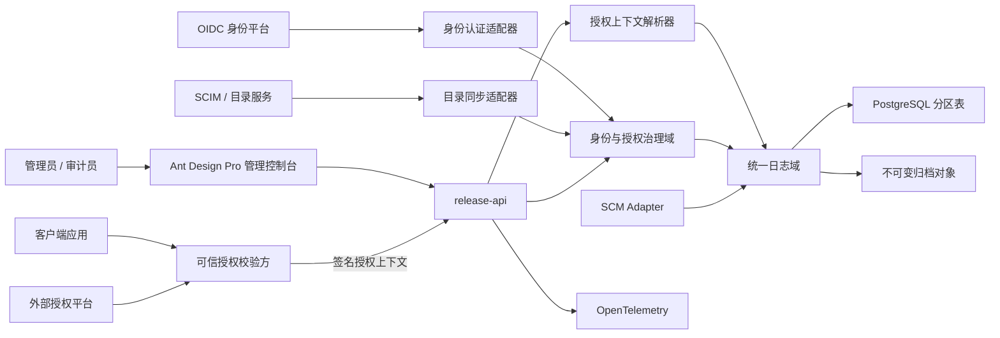
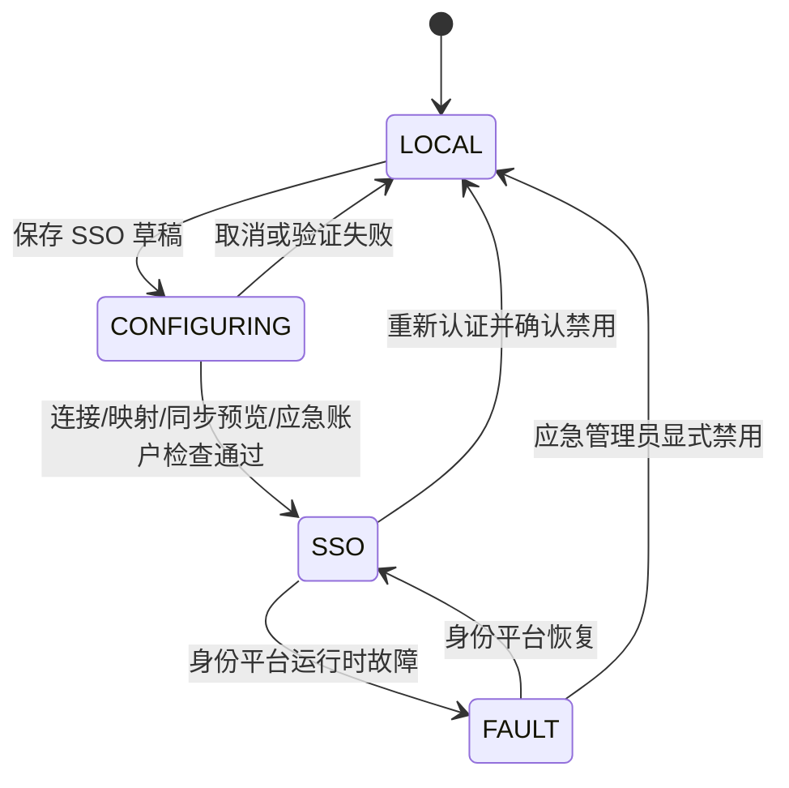

# Xminds Release Platform P0 身份治理与统一日志基线设计规格

| 项目 | 内容 |
|---|---|
| 文档版本 | v1.0 |
| 编制日期 | 2026-08-14 |
| 文档状态 | 已确认设计基线 |
| 适用阶段 | P0 生产实现与验收 |
| 关联主规格 | `2026-08-13-xminds-release-platform-p0-design.md` |
| 关联原型 | Open Design `xminds-release-console.html` |

## 1. 背景

P0 管理控制台原型已确认补充用户中心、组织架构、角色与权限、身份源配置及统一日志中心。应用请求日志还需展示请求客户、授权名称、发起请求的客户端应用版本、License ID、到期时间和请求时状态。

这些信息涉及身份、授权和 License 三类边界。若仅在前端增加展示字段，会产生来源不可信、历史状态漂移和敏感信息泄漏风险。本规格将已确认交互转化为可实施、可审计的后端契约，并明确 P0 只消费可信上游产生的授权判定结果，不建设 License 签发、计量、续期和吊销系统。

## 2. 建设目标

1. 建立外部身份同步、本地账户、组织、角色和产品范围的一致治理模型。
2. 固化“未启用 SSO 使用本地登录；启用 SSO 后默认 SSO，普通本地登录关闭，仅保留受控应急入口”的状态机。
3. 将操作日志、登录日志、应用请求日志和 Git 同步日志统一纳入日志中心。
4. 对每次应用请求保存不可变的请求时授权快照，确保历史记录不随上游授权变化而改变。
5. 建立明确的信任边界、脱敏、保留、归档、导出和关联查询规则。
6. 保持 Release、制品、可信目录、SCM 和分发端点领域边界不变。

## 3. 范围边界

### 3.1 P0 纳入范围

- 用户、组织、身份源、目录同步、角色绑定和产品/通道范围授权；
- 本地账户、应急管理员、MFA 策略状态和登录模式治理；
- OIDC 认证与 SCIM/目录适配端口；
- 操作、登录、应用请求和 Git 同步四类结构化日志；
- 请求时客户授权快照的接收、验证、固化、查询和展示；
- Request ID、Correlation ID 及业务对象关联检索；
- 在线保留、归档、证据导出和不可变审计控制；
- Ant Design Pro v6.6.0 浅色控制台、白色侧栏和白色详情抽屉。

### 3.2 P0 不纳入范围

- Tenant 商业计费模型；
- License 创建、签发、续期、扩容、计量、吊销和密钥生成；
- 在 Release Platform 内独立计算 License 合法性；
- 保存 License Key、授权签名私钥、完整令牌或请求正文；
- 实时日志流平台、通用全文检索引擎和跨地域日志湖；
- 自建企业身份提供商。

P0 的 License 相关能力严格限定为：接收经可信上游验证并签名的授权上下文，校验其真实性和时效性，将必要字段作为只读快照写入请求日志并用于审计展示。

## 4. 总体架构



核心规则：认证证明“是谁”，平台授权决定“能做什么”，可信上游授权上下文说明“该客户请求在当时以何种授权通过或拒绝”。三者不得相互替代。

## 5. 身份治理模型

### 5.1 核心对象

| 对象 | 职责 | 关键约束 |
|---|---|---|
| `UserPrincipal` | 统一表示外部、本地和应急用户 | 全局唯一主体 ID，历史引用不可复用 |
| `IdentitySource` | 描述本地、OIDC、SCIM 等来源 | Secret 仅保存引用，不保存可查询明文 |
| `OrganizationUnit` | 外部同步或平台本地组织 | 外部主数据字段只读 |
| `RoleBinding` | 主体到角色和范围的绑定 | 显式拒绝优先，停用状态优先 |
| `LocalCredential` | 本地账户凭据元数据 | 只保存 Argon2id 哈希和轮换元数据 |
| `SyncJob` | 一次目录同步任务 | 支持预览、差异、冲突和失败重试 |
| `EmergencyAccessEvent` | 应急登录与敏感操作记录 | 高风险标识、强制 MFA、完整审计 |

### 5.2 登录模式状态机



- `LOCAL`：普通本地账户和应急账户按策略登录；管理员强制 MFA。
- `CONFIGURING`：仅保存草稿和执行验证，不改变生产登录入口。
- `SSO`：普通用户默认走 SSO，普通本地登录被拒绝，应急入口独立可用。
- `FAULT`：继续拒绝普通本地登录，不得自动静默降级。
- 启用或禁用 SSO 必须重新认证、二次确认、满足前置条件并生成操作日志。

### 5.3 授权规则

- 内置角色为 `admin`、`publisher`、`approver`、`auditor`、`viewer`；
- 授权主体支持用户和组织；
- 作用域支持平台、产品、产品与通道；
- 同层允许授权取并集，显式拒绝优先；
- 用户停用、来源停用或会话撤销优先于所有允许规则；
- 审批者不得审批自己创建的 Release；
- API 是最终授权执行点，前端隐藏按钮不构成安全控制。

## 6. 请求时授权快照

### 6.1 字段定义

| 字段 | 含义 | 约束 |
|---|---|---|
| `customer_id` | 上游客户稳定标识 | 必填，不直接使用展示名作为主键 |
| `customer_name` | 请求时客户展示名称 | 快照字段，可随历史保留 |
| `tenant_id` | 可选的外部租户标识 | 仅关联，不启用 P0 多租户计费 |
| `authorization_name` | 请求时授权名称 | 必填，来自可信上下文 |
| `client_app_version` | 发起请求的客户端应用版本 | 与 License 包版本严格区分 |
| `license_id` | 上游 License 稳定标识 | 可查询标识符，不是 License Key |
| `license_expires_at` | 请求时已验证的到期时间 | 使用 UTC `timestamptz` |
| `license_status` | `valid`、`expiring`、`expired`、`revoked`、`unknown` | 保存请求时判定结果 |
| `decision` | `allow` 或 `deny` | 必填 |
| `reason_code` | 稳定判定原因码 | 不包含敏感内部堆栈 |
| `validated_at` | 上游完成校验的时间 | 必须位于允许时钟偏差内 |
| `validator_issuer` | 校验方标识 | 必须位于允许列表 |
| `context_digest` | 规范化上下文 SHA-256 | 用于完整性核验和去重 |

### 6.2 信任边界

客户端自行提供的普通 HTTP Header、Query 参数或请求体字段不得作为授权事实。API 只接受以下任一来源：

1. 受 mTLS 保护的内部网关注入，并由网络策略限制调用方；
2. 由允许列表中的校验方签发的短时 JWT/JWS，上下文必须校验签名、`iss`、`aud`、`exp`、`nbf` 和唯一请求绑定；
3. 进程内受信任授权适配器直接产生的类型化对象。

上下文校验失败时，API 必须拒绝受保护请求，记录 `deny` 与稳定原因码，但不得把未经验证的客户、授权或 License 字段写成可信事实。

### 6.3 不可变语义

- 快照在请求完成时一次写入，禁止后续更新或回填；
- 上游客户名称、License 状态或到期时间变化不影响历史请求；
- 日志详情必须明确标注“请求时快照”，不得误导为当前实时授权状态；
- 如需展示当前状态，应通过独立、明确标识的实时查询区域完成，P0 不实现该区域；
- 拒绝请求同样记录快照、判定与原因，但不记录令牌、签名原文或 License Key。

## 7. 统一日志模型

### 7.1 日志类型

| 类型 | 主要字段 | 典型用途 |
|---|---|---|
| 操作日志 | 操作者、角色、产品、动作、目标、前后摘要、结果 | 安全审计与责任追溯 |
| 登录日志 | 主体、来源、认证方式、IP、客户端、结果、失败原因 | 身份安全与异常登录排查 |
| 应用请求日志 | API 元数据、耗时、请求标识、授权快照 | 客户请求定位与授权证据 |
| Git 同步日志 | Provider、仓库、Commit/Tag、阶段、重试、结果 | SCM 集成排障 |

### 7.2 通用关联字段

所有日志至少包含 `event_id`、`occurred_at`、`request_id`、`correlation_id`、`trace_id`、`product_id`、`result`、`source_ip` 和 `schema_version`。业务对象使用类型与 ID 对关联，不保存可变 URL 作为唯一关联键。

应用请求日志另外保存 HTTP 方法、路由模板、状态码、耗时、客户端应用标识和请求时授权快照。禁止记录原始 Query String、完整请求体、Cookie、Authorization Header、Token、密码、私钥和恢复代码。

### 7.3 存储与保留

- 四类日志使用独立表或逻辑分区，按月分区；
- 在线热数据默认保留 90 天，归档证据默认保留 365 天；
- 保留周期由配置管理，缩短周期属于高风险变更；
- 操作审计和证据归档采用 append-only 权限，业务账号无 `UPDATE`、`DELETE` 权限；
- 归档对象包含清单、摘要和签名，导入前校验完整性；
- 清理任务只处理超过策略期限且已满足归档条件的分区，并生成自身审计事件。

## 8. API 契约

### 8.1 身份治理 API

```text
GET    /api/v1/users
POST   /api/v1/local-users
GET    /api/v1/users/{id}
POST   /api/v1/users/{id}/disable
POST   /api/v1/users/{id}/enable
POST   /api/v1/users/{id}/revoke-sessions
GET    /api/v1/organizations
POST   /api/v1/organizations
GET    /api/v1/role-bindings
POST   /api/v1/role-bindings
DELETE /api/v1/role-bindings/{id}
GET    /api/v1/identity-sources
POST   /api/v1/identity-sources
PATCH  /api/v1/identity-sources/{id}
POST   /api/v1/identity-sources/{id}/verify
POST   /api/v1/identity-sources/{id}/sync-preview
POST   /api/v1/identity-sources/{id}/sync
POST   /api/v1/identity-sources/{id}/enable
POST   /api/v1/identity-sources/{id}/disable
```

### 8.2 日志中心 API

```text
GET  /api/v1/logs/operations
GET  /api/v1/logs/authentications
GET  /api/v1/logs/application-requests
GET  /api/v1/logs/git-syncs
GET  /api/v1/logs/related
POST /api/v1/log-exports
GET  /api/v1/log-exports/{id}
```

列表使用游标分页。应用请求日志支持按时间、产品、客户、授权名称、客户端应用版本、License ID、License 状态、结果、HTTP 状态、Request ID 和 Correlation ID 组合筛选。错误响应遵循 RFC 9457，并返回稳定业务码和 Request ID。

## 9. 控制台设计映射

- 导航新增“系统管理”，包含用户中心、角色与权限、身份源配置；
- “审计”统一命名为“日志中心”，包含四个一级页签；
- 应用请求表格优先展示时间、客户、授权名称、客户端应用版本、License ID、到期时间、状态、HTTP 状态和请求 ID；
- 1280px 视口使用横向表格滚动，时间和客户列固定，页面本身不得横向溢出；
- License ID 在列表可缩略，在白色详情抽屉展示完整值并支持受控复制；
- 详情抽屉使用 760 至 840px 白色表面，标注“请求时授权快照”；
- 左侧导航、Logo 区和折叠控制区统一白色，当前项使用浅蓝背景和蓝色文字；
- 设计基线固定为 Ant Design Pro v6.6.0、Ant Design 6 和 ProComponents v3 交互模式。

## 10. 安全设计

- 本地管理员和应急管理员强制 MFA；
- 本地密码使用 Argon2id，并实施长度、历史、轮换、失败锁定和速率限制；
- 激活令牌、恢复代码和 API Token 只显示一次，数据库仅保存摘要；
- SSO Secret、目录凭据和授权校验密钥通过 Secret 引用注入；
- 目录同步执行最小权限，外部主数据字段只读；
- 高权限授权、SSO 切换和应急操作必须重新认证和二次确认；
- License ID 是可审计标识符，不得混同 License Key；
- 日志导出实施字段级权限、审批、有效期和下载审计；
- 所有输入执行长度、格式和枚举校验，路由日志使用模板而非原始敏感路径。

## 11. 可观测性、可用性与恢复

至少采集以下指标：身份源连接状态、同步延迟与失败数、登录失败率、应急登录次数、权限拒绝数、授权上下文校验失败数、各类日志写入失败数、查询 P95、导出队列深度、归档失败数和分区容量。

告警至少覆盖：SSO 长期不可达、最后一个应急账户不可用、同步持续失败、授权上下文签名失败突增、日志落库失败、审计归档完整性失败和存储容量不足。

日志写入不得静默失败。安全审计写入失败时，高风险管理操作采用 fail closed；普通请求日志可进入受限本地缓冲并重试，缓冲耗尽时告警和限流。备份恢复演练必须验证身份配置、角色绑定、日志分区、归档清单和请求时授权快照可恢复且摘要一致。

## 12. 验收标准

1. 可管理外部同步用户、本地账户、组织、角色和产品/通道范围。
2. SSO 未启用时使用本地登录；启用后普通本地登录被拒绝，仅受控应急入口可用。
3. SSO 故障不会自动降级为普通本地登录，且无法停用最后一个可用应急管理员。
4. 外部主数据更新不会覆盖平台角色和产品授权。
5. 操作、登录、应用请求和 Git 同步日志均可筛选、查看详情和关联检索。
6. 应用请求日志可准确显示请求客户、授权名称、客户端应用版本、完整 License ID、到期时间和请求时状态。
7. 修改上游 License 状态后，历史请求快照保持不变。
8. 未验证或过期的授权上下文被拒绝，不得写成可信授权事实。
9. 任何列表、详情、日志、导出和错误响应均不出现 License Key、令牌、密码、私钥或完整请求体。
10. 白色侧栏、白色详情抽屉及 1280px/1440px 桌面布局通过浏览器回归。
11. 所有高风险身份和授权变更均可通过 Request ID、操作者、目标和前后摘要追溯。
12. 在线保留、归档、清理和联合恢复演练通过，归档摘要验证成功。

## 13. 风险分析

| 风险 | 影响 | 控制措施 |
|---|---|---|
| 信任客户端自报 License 信息 | 伪造授权证据 | 仅接受 mTLS 网关、签名上下文或进程内可信适配器 |
| 将客户端应用版本误认为 License 版本 | 查询和决策错误 | 字段命名、标签和契约明确区分 |
| 历史快照被实时数据覆盖 | 审计证据失真 | append-only 快照、禁止更新和回填 |
| SSO 故障自动开放本地登录 | 绕过条件访问与离职停用 | fail closed，仅独立应急入口 |
| 日志采集敏感载荷 | 数据泄漏和合规风险 | 数据最小化、字段允许清单、导出权限和自动扫描 |
| 日志量增长过快 | 查询退化和存储耗尽 | 月分区、容量指标、在线保留和不可变归档 |
| P0 演变为 License 平台 | 延迟可信发布主线 | 只读快照边界，生命周期能力继续后置 |

## 14. 结论

P0 在可信发布主线之外增加两个受控闭环：身份治理闭环，以及统一日志与请求时授权快照闭环。平台可准确回答“谁在何时以什么权限执行了什么操作”和“哪个客户的哪个客户端版本在当时使用何种授权发起请求”，但不承担 License 生命周期管理。该边界兼顾已确认原型、生产安全和后续商业化演进。
